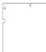

# Debug Module (DM) Daughtercard Design Notes

**NOTE:** These notes are the WIP version of the specification for lethallink Debug Module (DM) interface, for the version that is released and shipped for each revision of the board, consult the appropriate reference manual.

## Abstract

Do to the difficulty in providing an "all-in-one" solution that is flexible enough to allow to the low-level interfacing to machines, it has been decided that most of the architecture specific hardware to a daughtercard using a modified DDR4 SODIMM 260 pin format.

This allows for a substantial amount of IO and power to be provided to the daughtercard. Enabling a proper high-speed bus between the main system FPGA and any of the on-board machinery for data transport and a QSPI control channel for management and configuration.

## Electromechanical Specification

The electromechanical specification for the DM daughtercards follows much of normal specification for a DDR4 SODIMM with 260 positions, however it is longer and has a mounting hole for a 8mm tall M3 standoff.

Below you can see a sketch of the profile for the daughtercards:

**NOTE:** This drawing is not to scale, for a to-scale drawing with all the measurements see the SolveSpace CAD files in the [`docs/cad/`](../docs/cad/) directory. Alternatively, you can inspect the [lethallink KiCad library](../docs/eda) where there is a footprint and schematic part. Or, lastly, use inspect one of the [debug modules](../hardware/boards), or use the [debug module template KiCad project](../hardware/boards/template_dm).

	

